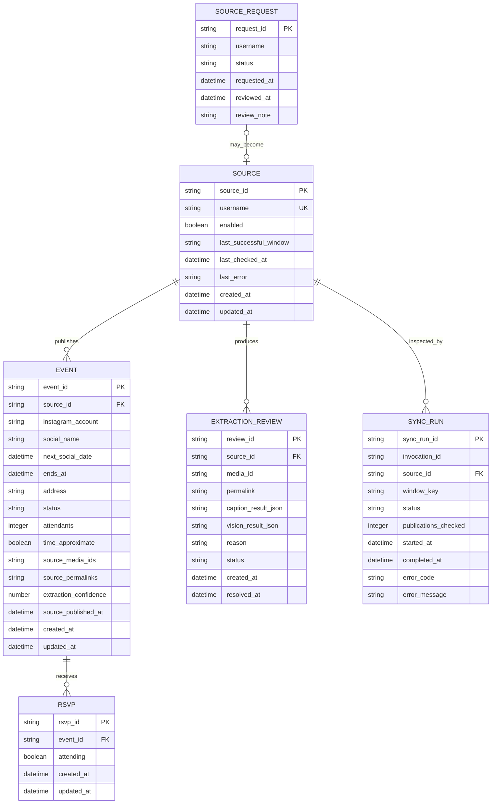

# Entity Relationship Diagram

This is the conceptual data model for the Google Sheets persistence described in [the SRS](./03_SRS.md) and [project plan](./04_PMP.md). Each entity maps to one spreadsheet tab. Sheet row numbers are never identifiers.

## Relationships

| From | To | Cardinality | Notes |
| --- | --- | --- | --- |
| Source | Event | One to many | Every event has one Instagram source; a source can publish many events. |
| Event | RSVP | One to many | Each row is the current anonymous state for one event/browser-derived identifier. |
| Source | ExtractionReview | One to many | Conflicting or incomplete candidates remain associated with their source publication. |
| Source | SyncRun | One to many | A source has one current record per synchronization window, updated by retries. |
| SourceRequest | Source | Optional one to optional one | A pending request only becomes related after manual operator approval. |

## Entity semantics

### Sources

- `source_id` is a stable identifier derived from the normalized username.
- `username` is lowercase and stored without `@`.
- `enabled` is the synchronization switch.
- `last_successful_window` controls idempotency independently of event updates.
- Changing a username creates a new source unless the operator performs an explicit migration.

### Events

- The tab includes the product fields requested for the MVP: Instagram account, next social date, address, social name, attendants, and updated time.
- `event_id` is derived from source, local event date, and normalized social name.
- `next_social_date` is an ISO timestamp with the Rosario offset and represents the start.
- `ends_at` is optional.
- `status` is `active` or `cancelled`; being past is derived from time.
- `attendants` is a denormalized count of RSVPs whose current state is attending.
- `time_approximate` distinguishes manually configured recurring times from confirmed publication times.
- `source_media_ids` and `source_permalinks` are ordered, delimiter-safe JSON arrays serialized into cells.
- `updated_at` changes only when accepted event content changes. Synchronization without a content change does not alter it.
- Synchronization must preserve `attendants`.

### RSVPs

- `rsvp_id` is an HMAC of event ID and the browser's local token.
- The raw browser token is never stored.
- Including the event ID in the HMAC prevents the public sheet from linking one browser's choices across events.
- `attending` stores the current toggle state, allowing undo without deleting audit timing.

### Source requests

- The public form stores only a normalized Instagram username.
- `status` is `pending`, `approved`, or `rejected`.
- Approval is manual: the operator creates or enables a Sources row and updates the request.
- `review_note` is optional operational text and must not contain requester identity.

### Extraction reviews

- `review_id` is stable for one source and publication so reruns update rather than duplicate the issue.
- Caption and vision results are stored as bounded JSON for comparison and debugging.
- `status` is `pending`, `resolved`, or `ignored`.
- Resolving a review does not automatically create an event; the operator corrects Events or allows a later successful synchronization to upsert it.

### Sync runs

- One row represents one source within one invocation and synchronization window.
- `window_key` distinguishes Monday-to-Wednesday from Wednesday-to-Monday in Rosario time.
- `status` is `running`, `succeeded`, `failed`, or `skipped`.
- Retries create a new invocation row; `Sources.last_successful_window` remains the idempotency authority.

## Retention

- Events are removed 48 hours after their explicit or inferred end.
- RSVP rows are removed with their event.
- Extraction reviews and synchronization runs are retained for 30 days.
- Sources and source-request decisions are not automatically removed.
- Future events are retained even when they fall outside the public seven-day display window.

## Constraints

- Source username is unique after lowercase normalization and removal of `@`.
- Event ID is unique.
- RSVP ID is unique.
- A pending source request is unique by normalized username.
- A source has at most one successful outcome for a synchronization window.
- `attendants` is non-negative and equals the active RSVP count after a successful RSVP write.
- Automatically published events require a name, address, and valid future start.
- All machine timestamps are ISO 8601. Calendar rules use `America/Argentina/Cordoba`.
- Media URLs and access credentials are never persisted.

## Public-data rules

- The spreadsheet may be publicly readable, so every tab is treated as potentially public.
- No raw browser token, IP address, name, email, API key, access token, or service-account field is stored.
- If Google publication settings allow tab-level publication, only Events should be published as CSV for the application feed.
- Write permission is limited to the spreadsheet owner and the SalseRos service account.

## Out of scope for this ERD

- Registered users and authenticated sessions.
- Verified attendance or ticket ownership.
- Venue entities, maps, and geospatial data.
- Stored Instagram media files.
- Scheduler configuration.
- Provider credentials and Vercel deployment metadata.
